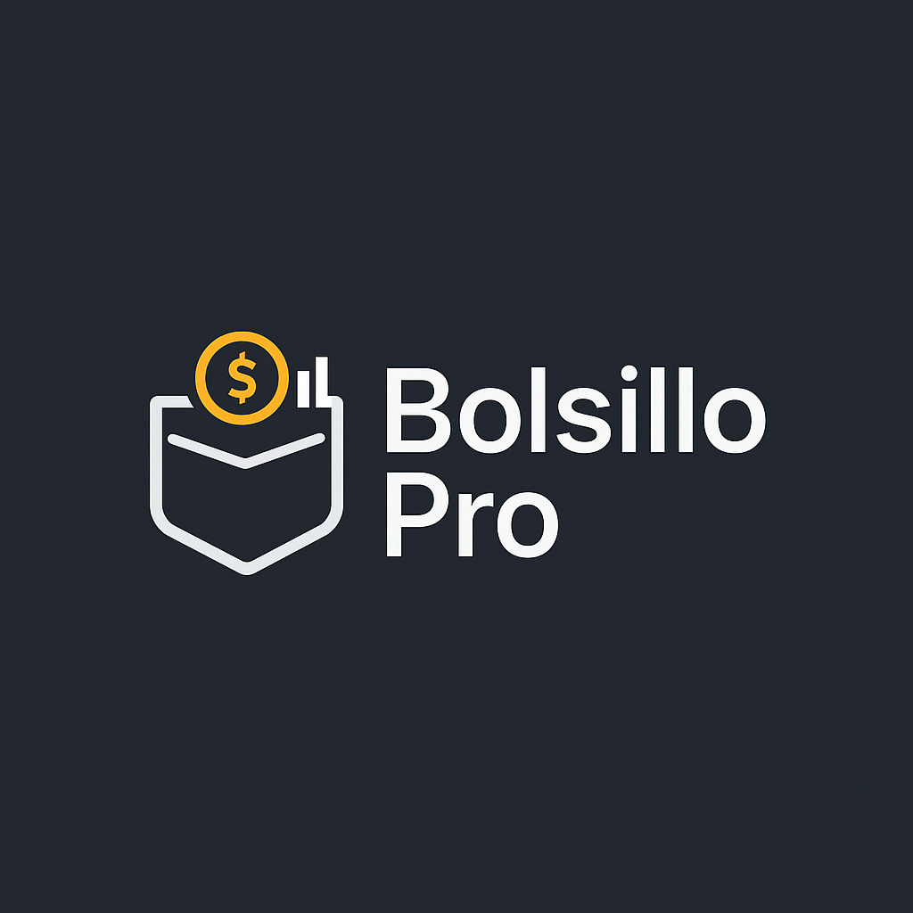

<p align="center">
  
</p>

# 💰 Bolsillo Pro

**Bolsillo Pro** es una aplicación web desarrollada en **Laravel** con **MySQL**, diseñada para ayudarte a llevar un control personal de tus finanzas, organizando tus **gastos** y **ahorros** de forma clara, rápida y segura.

---

## ✨ Características principales

- ✅ Registro de ingresos y egresos por categorías.
- 📊 Panel de control con resumen financiero diario/mensual.
- 💾 Visualización del ahorro acumulado y gasto neto.
- 📅 Reportes mensuales de actividad financiera.
- 📱 Interfaz moderna y adaptable.
- 🔐 Preparado para autenticación y seguridad.

---

## 🧪 Tecnologías usadas

- ⚙️ **Laravel** (PHP Framework Backend)
- 🧠 **Blade** (Sistema de plantillas)
- 🐬 **MySQL** (Base de datos relacional)
- 🎨 **Bootstrap 5** (Estilo moderno)
- 🌈 **Phoenix UI** (Diseño y componentes personalizados)

---

## 🚀 Instalación del proyecto

Sigue estos pasos para instalar Bolsillo Pro en tu máquina local:

### 1. Clonar el repositorio

git clone https://github.com/jzambranor-dev/Bolsillo_Pro.git
cd Bolsillo_Pro

### 2. Instalar dependencias de PHP
composer install

### 3. Crear archivo de configuración
cp .env.example .env

### 4. Configurar la base de datos en .env
<pre> ```env DB_CONNECTION=mysql DB_HOST=127.0.0.1 DB_PORT=3306 DB_DATABASE=bolsillo_pro DB_USERNAME=root DB_PASSWORD= ``` </pre>

### 5. Generar clave de la aplicación

php artisan key:generate

### 6. Migrar la base de datos

php artisan migrate

### 7. Levantar el servidor local

php artisan serve

👉 http://localhost:8000